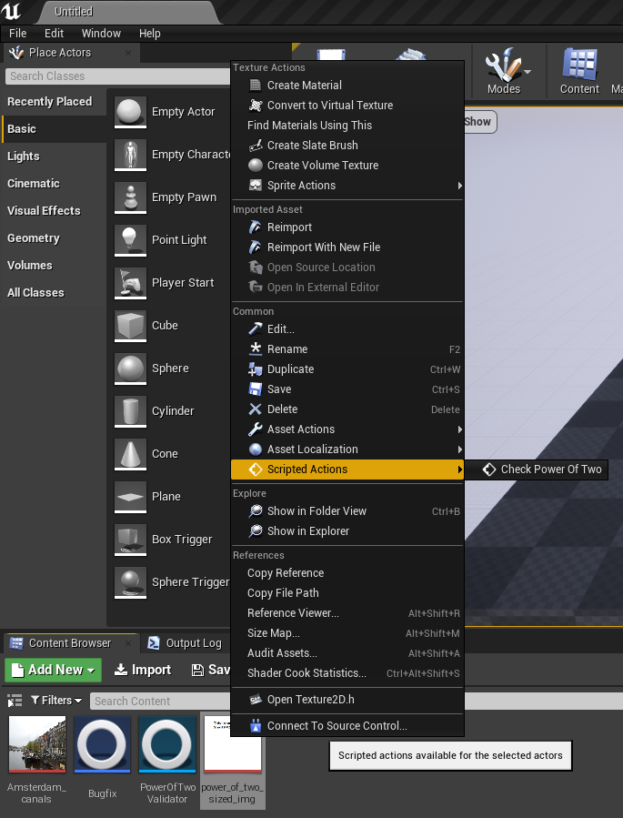

# Power_Of_Two_Texture_Validator_for_UE4

This C++ Unreal Engine class provides a function that determines if the size of a texture is a power of two. When successfully built, the class extends the editor: by simply right clicking on an object with a texture, one can select "Check Power Of Two" to run the script on the texture. The result will appear in the editor window.

Why is this something that should be done? It is important that a texture should be of a size power of two to make more efficient use of memory.

When an object-whether it is a texture or something else- is loaded from source into memory, it is loaded *2^N* bytes at a time, where *N* is equal to the
number of bits in the memory address bus.

The minimum number of reads from source into the memory address is* (X/(2^N))*, where *X* is the size of the object in bytes. If X is an exact power of two,
the object will be read completely in *((2^M)/(2^N))* times, where *M* is the number of bits required to store the object.

If the data size is NOT a power of two, there will be extra reads from source to get all the data into memory. This will result in more operations necessary
to completely read the data into memory, which will result in a slower application, especially on mobile devices.

## How to Use this class in your UE4 project? ##
The easiest way is to create a new C++ class of the same name, then copy and paste the header and implementation into the C++ class created. Compile your Unreal Editor project. If there are no issues, create a Blueprint class whose parent is the C++ class, then create an Editor Utility Blueprint whose parent class is the Blueprint class. Compile again to make sure all is well. If everything went well, you should be able to right click a texture, see a section called Scripted Actions, and be able to choose "Check Power Of Two" from this section, like in the image below.

